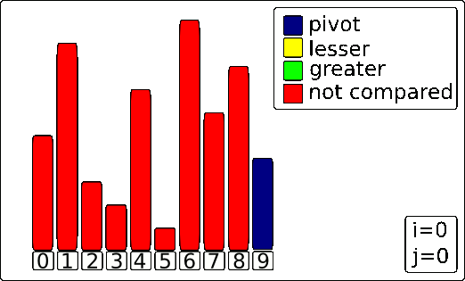

# Quick Sort

The algorithm was developed by a British computer scientist Tony Hoare in 1959. It is still a commonly used algorithm for sorting. When implemented well, it can be about two or three times faster than its main competitors, [merge sort] and [heapsort].

[merge sort]: ../merge-sort
[heapsort]: ../heapsort
[divide and conquer algorithm]: https://en.wikipedia.org/wiki/Divide-and-conquer_algorithm

Quicksort is a [divide and conquer algorithm]. It works by selecting a 'pivot' element from the array and partitioning the other elements into two sub-arrays, according to whether they are less than or greater than the pivot. The sub-arrays are then sorted recursively. This can be done in-place, requiring small additional amounts of memory to perform the sorting.

There are many different versions of quickSort that pick pivot in different ways:

- Always pick first element as pivot.
- Always pick last element as pivot (implemented below)
- Pick a random element as pivot.
- Pick median as pivot.

# Performance

| Name                  | Best            | Average             | Worst               | Memory    |
| --------------------- | :-------------: | :-----------------: | :-----------------: | :-------: |
| **Quicksort**    | n log(n)        |  n log(n)           | n^2                 | log(n)    |  

## References

- [Wikipedia](https://en.wikipedia.org/wiki/Quicksort)

